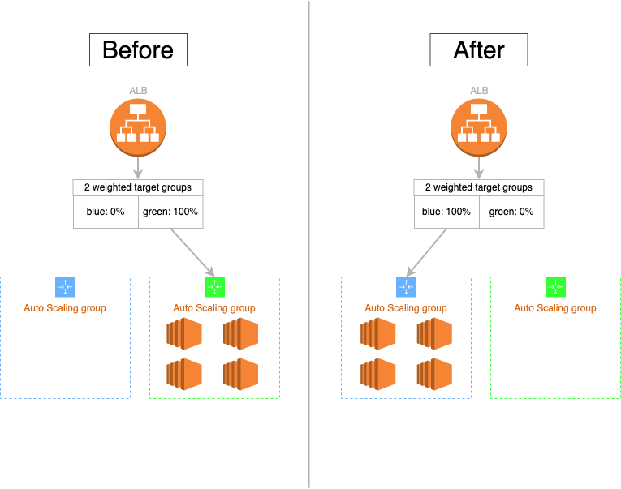

# Deployman
CLI to control and deploy ALB and two AutoScalingGroups. A similar solution is CodeDeploy. However, it does not maintain a blue/green environment. Basically CodeDeploy tries to replicate one AutoScalingGroup and remove the old one, which is difficult to manage infrastructure with Terraform or any other IaC. It also does not allow for fine-grained control of traffic through ALB weighted target groups. This CLI was created to solve those problems.

# How it works
### About deployment
This CLI enables B/G deployments by manipulating ALB weighted target groups to control traffic. It works as follows.

1. set the capacity of the AutoScalingGroup associated with the blue target group to the same state as the capacity of the AutoScalingGroup associated with the green target group.
2. change the two weighted target groups in the ALB listener rule to swap traffic.
3. Once the traffic has been replaced, set the capacity (MinSize) of the AutoScalingGroup associated with the blue target group to 0. This is designed with the assumption that the capacity will gradually shrink due to auto scale-in.
4. rollback can be performed if necessary.

    

- NOTES: This CLI could be applied to Canary deployments as well, as it provides fine-grained control over ALB-weighted target groups.

### About bundle management
This CLI has the ability to register and search for the respective application bundles in blue or green to achieve the above deployment. Bundles will be managed in S3 and configured as follows.
And then, keeps up to 100 of the latest bundles.

```
S3 bucket/
    ┣ bundles/
    ┃   ┣ xxxxxxxxx.zip
    ┃   ┣ yyyyyyyyy.zip
    ┃   ┗ zzzzzzzzz.zip
    ┣ active_bundle_blue  -> Text file pointing to the bundle file name for deployment in blue env
    ┗ active_bundle_green -> Text file pointing to the bundle file name for deployment in green env
```

# Install
There are the following methods.

### 1. Download binary
```shell
version=x.x.x
arch=darwin_arm64
wget https://github.com/givery-technology/deployman/releases/download/${version}/deployman_${version}_${arch}.zip -O deployman.zip && unzip deployman.zip deployman && rm deployman.zip
```

### 2. Compile from source
You should have the latest go installed (>= 1.19).
```bash
cd ./cmd/deployman && go build
```

# Requirements
- Requires `AWS_ACCESS_KEY/AWS_SECRET_ACCESS_KEY` or `AWS_PROFILE`, and `AWS_REGION` environment variables.
- You will need `deployman.json` in the same location as the deploynam The contents are as follows.

    ```json
    {
      "bundleBucket": "bundle-bucket",
      "listenerRuleArn": "arn:aws:elasticloadbalancing:xxxx:xxxx:listener-rule/app/xxxx/xxxx",
      "target": {
        "blue": {
          "autoScalingGroupName": "blue-target",
          "targetGroupArn": "arn:aws:elasticloadbalancing:xxxx:xxxx:targetgroup/blue-target/xxxx"
        },
        "green": {
          "autoScalingGroupName": "green-target",
          "targetGroupArn": "arn:aws:elasticloadbalancing:xxxx:xxxx:targetgroup/green-target/xxxx"
        }
      }
    }
    ```
 
    | ATTRIBUTE                                   | REQUIRED | TYPE   | DESCRIPTION                                                   |
    |---------------------------------------------|----------|--------|---------------------------------------------------------------|
    | bundleBucket                                | true     | string | S3 bucket name for application bundles to be deployed.        |
    | listenerRuleArn                             | true     | string | Rule ARN of the ALB listener to deploy to.                    |
    | target.{blue or green}.autoScalingGroupName | true     | string | Name of the AutoScalingGroup for blue or green, respectively. |
    | target.{blue or green}.targetGroupArn       | true     | string | ARN of the ALB's TargetGroup for blue or green, respectively. |

# Usage
### commands
```shell
usage: deployman [<flags>] <command> [<args> ...]

A CLI for controlling ALB and two AutoScalingGroups and performing Blue/Green Deployment.

Flags:
  --help                       Show context-sensitive help (also try --help-long and --help-man).
  --config="./deployman.json"  [OPTIONAL] Configuration file path. By default, this value is './deployman.json'. If this file does not exist, an error will occur.
  --verbose                    [OPTIONAL] A detailed log containing call stacks will be error messages.

Commands:
  help [<command>...]
    Show help.

  version
    Show current CLI version.

  bundle register --file=FILE --name=NAME [<flags>]
    Register a new application bundle with any name, specifying the local file path to S3 bucket.

  bundle list
    List registered application bundles.

  bundle activate --target=TARGET --name=NAME
    Activate one of the registered bundles. The active bundle will be used for the next deployment or scale-out.

  bundle download --target=TARGET
    Download application bundle file.

  ec2 status
    Show current deployment status.

  ec2 deploy [<flags>]
    Deploy a new application to an idling AutoScalingGroup.

  ec2 rollback [<flags>]
    Restore the AutoScalingGroup to their original state, then swap traffic.

  ec2 cleanup
    Terminate all instances that are idle, i.e., in an AutoScalingGroup with a traffic weight of 0. You can check the current status with the 'ec2 status' command.

  ec2 swap [<flags>]
    B/G Swap the current traffic of the respective 2 AutoScalingGroups. You can check the current status with the 'ec2 status' command.

  ec2 traffic --blue=BLUE --green=GREEN
    Update the traffic of the respective target group of B/G to any value. You can check the current status with the 'ec2 status' command.

  ec2 autoscaling --target=TARGET [<flags>]
    Update the capacity of any AutoScalingGroup.

  ec2 move-scheduled-actions --from=FROM --to=TO
    Move ScheduledActions that exist in any AutoScalingGroup to another AutoScalingGroup.
```

### bundle register
```shell
usage: deployman bundle register --file=FILE --name=NAME [<flags>]

Register a new application bundle with any name, specifying the local file path to S3 bucket.

Flags:
  --help                       Show context-sensitive help (also try --help-long and --help-man).
  --config="./deployman.json"  [OPTIONAL] Configuration file path. By default, this value is './deployman.json'. If this file does not exist, an error will occur.
  --verbose                    [OPTIONAL] A detailed log containing call stacks will be error messages.
  --file=FILE                  [REQUIRED] File name and path in local
  --name=NAME                  [REQUIRED] Name of bundle to be registered
  --with-activate              [OPTIONAL] Associate (activate) this bundle with an idle AutoScalingGroup.
```

### bundle list
```shell
usage: deployman bundle list

List registered application bundles.

Flags:
  --help                       Show context-sensitive help (also try --help-long and --help-man).
  --config="./deployman.json"  [OPTIONAL] Configuration file path. By default, this value is './deployman.json'. If this file does not exist, an error will occur.
  --verbose                    [OPTIONAL] A detailed log containing call stacks will be error messages.
```
- output sample: This example shows that the bundle deployed in blue-AutoScalingGroup is #1 and the bundle deployed in green-AutoScaling is #2.
    ```shell
    Bucket: orca-deploy-bundle-dev
    +----+---------------------------+-----------------------------+----------------+
    | #  |       LAST UPDATED        |         BUNDLE NAME         |     STATUS     |
    +----+---------------------------+-----------------------------+----------------+
    |  1 | 2022-10-26T18:27:06+09:00 | 20221026092702-7b97de6d.zip | active:[blue]  |
    |  2 | 2022-10-26T14:22:22+09:00 | 20221026052219-c9e4c6ef.zip | active:[green] |
    |  3 | 2022-10-19T14:06:56+09:00 | 20221007083852-f3fdc1f5.zip |                |
    |  4 | 2022-10-19T14:06:28+09:00 | 20221007083852-f3fdc1f4.zip |                |
    |  5 | 2022-10-19T14:01:07+09:00 | 20221007083852-f3fdc1f3.zip |                |
    +----+---------------------------+-----------------------------+----------------+
    ```

### bundle acrivate
```shell
usage: deployman bundle activate --target=TARGET --name=NAME

Activate one of the registered bundles. The active bundle will be used for the next deployment or scale-out.

Flags:
  --help                       Show context-sensitive help (also try --help-long and --help-man).
  --config="./deployman.json"  [OPTIONAL] Configuration file path. By default, this value is './deployman.json'. If this file does not exist, an error will occur.
  --verbose                    [OPTIONAL] A detailed log containing call stacks will be error messages.
  --target=TARGET              [REQUIRED] Target type for bundle. Valid values are either 'blue' or 'green'. The 'ec2 status' command allows you to check the target details.
  --name=NAME                  [REQUIRED] Bundle Name. Valid names can be checked with the 'bundle list' command.
```

### bundle download
```shell
usage: deployman bundle download --target=TARGET

Download application bundle file.

Flags:
  --help                       Show context-sensitive help (also try --help-long and --help-man).
  --config="./deployman.json"  [OPTIONAL] Configuration file path. By default, this value is './deployman.json'. If this file does not exist, an error will occur.
  --verbose                    [OPTIONAL] A detailed log containing call stacks will be error messages.
  --target=TARGET              [REQUIRED] Target type for bundle. Valid values are either 'blue' or 'green'. The 'ec2 status' command allows you to check the target details.
```

### ec2 status
```shell
usage: deployman ec2 status

Show current deployment status.

Flags:
  --help                       Show context-sensitive help (also try --help-long and --help-man).
  --config="./deployman.json"  [OPTIONAL] Configuration file path. By default, this value is './deployman.json'. If this file does not exist, an error will occur.
  --verbose                    [OPTIONAL] A detailed log containing call stacks will be error messages.
```
- output sample: TARGET is a blue/green classification. It displays the percentage of each traffic weight and the status of the associated AutoScalingGroup and TargetGroup.
    ```shell
    +--------+------------+----------------+-------------+---------+---------+---------------+----------------+-----------+-------------+---------------+------------+-------------+--------------+
    | TARGET | TRAFFIC(%) |    ASG:NAME    | ASG:DESIRED | ASG:MIN | ASG:MAX | ASG:LIFECYCLE |   ELB:TGNAME   | ELB:TOTAL | ELB:HEALTHY | ELB:UNHEALTHY | ELB:UNUSED | ELB:INITIAL | ELB:DRAINING |
    +--------+------------+----------------+-------------+---------+---------+---------------+----------------+-----------+-------------+---------------+------------+-------------+--------------+
    | blue   |          0 |  asg-blue      |           0 |       0 |       4 |               |   tg-blue      |         0 |           0 |             0 |          0 |           0 |            0 |
    | green  |        100 |  asg-green     |           1 |       1 |       4 | InService:1   |   tg-green     |         1 |           1 |             0 |          0 |           0 |            0 |
    +--------+------------+----------------+-------------+---------+---------+---------------+----------------+-----------+-------------+---------------+------------+-------------+--------------+
    ```

### ec2 deploy
```shell
usage: deployman ec2 deploy [<flags>]

Deploy a new application to an idling AutoScalingGroup.

Flags:
  --help                       Show context-sensitive help (also try --help-long and --help-man).
  --config="./deployman.json"  [OPTIONAL] Configuration file path. By default, this value is './deployman.json'. If this file does not exist, an error will occur.
  --verbose                    [OPTIONAL] A detailed log containing call stacks will be error messages.
  --silent                     [OPTIONAL] Skip confirmation before process.
  --no-cleanup                 [OPTIONAL] Skip cleanup of idle old AutoScalingGroups that are no longer needed after deployment.
  --duration=0s                [OPTIONAL] Time to wait until traffic is completely swapped. Default is '0s'. If this value is set to '60s', the B/G traffic is distributed 50:50 and waits for 60 seconds. After that, the B/G traffic will be completely swapped.
```

### ec2 rollback
```shell
usage: deployman ec2 rollback [<flags>]

Restore the AutoScalingGroup to their original state, then swap traffic.

Flags:
  --help                       Show context-sensitive help (also try --help-long and --help-man).
  --config="./deployman.json"  [OPTIONAL] Configuration file path. By default, this value is './deployman.json'. If this file does not exist, an error will occur.
  --verbose                    [OPTIONAL] A detailed log containing call stacks will be error messages.
  --silent                     [OPTIONAL] Skip confirmation before process.
  --no-cleanup                 [OPTIONAL] Skip cleanup of idle old AutoScalingGroups that are no longer needed after deployment.
  --duration=0s                [OPTIONAL] Time to wait until traffic is completely swapped. Default is '0s'. If this value is set to '60s', the B/G traffic is distributed 50:50 and waits for 60 seconds. After that, the B/G traffic will be completely swapped.
```

### ec2 cleanup
```shell
usage: deployman ec2 cleanup

Terminate all instances that are idle, i.e., in an AutoScalingGroup with a traffic weight of 0. You can check the current status with the 'ec2 status' command.

Flags:
  --help                       Show context-sensitive help (also try --help-long and --help-man).
  --config="./deployman.json"  [OPTIONAL] Configuration file path. By default, this value is './deployman.json'. If this file does not exist, an error will occur.
  --verbose                    [OPTIONAL] A detailed log containing call stacks will be error messages.
```

### ec2 swap
```shell
usage: deployman ec2 swap [<flags>]

B/G Swap the current traffic of the respective 2 AutoScalingGroups. You can check the current status with the 'ec2 status' command.

Flags:
  --help                       Show context-sensitive help (also try --help-long and --help-man).
  --config="./deployman.json"  [OPTIONAL] Configuration file path. By default, this value is './deployman.json'. If this file does not exist, an error will occur.
  --verbose                    [OPTIONAL] A detailed log containing call stacks will be error messages.
  --duration=0s                [OPTIONAL] Time to wait until traffic is completely swapped. Default is '0s'. If this value is set to '60s', the B/G traffic is distributed 50:50 and waits for 60 seconds. After that, the B/G traffic will be completely swapped.
```

### ec2 traffic
```shell
usage: deployman ec2 traffic --blue=BLUE --green=GREEN

Update the traffic of the respective target group of B/G to any value. You can check the current status with the 'ec2 status' command.

Flags:
  --help                       Show context-sensitive help (also try --help-long and --help-man).
  --config="./deployman.json"  [OPTIONAL] Configuration file path. By default, this value is './deployman.json'. If this file does not exist, an error will occur.
  --verbose                    [OPTIONAL] A detailed log containing call stacks will be error messages.
  --blue=BLUE                  [REQUIRED] Traffic weight for blue TargetGroup
  --green=GREEN                [REQUIRED] Traffic weight for green TargetGroup
```

### ec2 autoscaling
```shell
usage: deployman ec2 autoscaling --target=TARGET [<flags>]

Update the capacity of any AutoScalingGroup.

Flags:
  --help                       Show context-sensitive help (also try --help-long and --help-man).
  --config="./deployman.json"  [OPTIONAL] Configuration file path. By default, this value is './deployman.json'. If this file does not exist, an error will occur.
  --verbose                    [OPTIONAL] A detailed log containing call stacks will be error messages.
  --target=TARGET              [REQUIRED] Target type of AutoScalingGroup. Valid values are either 'blue' or 'green'. The 'ec2 status' command allows you to check the target details.
  --desired=-1                 [OPTIONAL] DesiredCapacity
  --min=-1                     [OPTIONAL] MinSize
  --max=-1                     [OPTIONAL] MaxSize
```

### ec2 move-scheduled-actions
```shell
usage: deployman ec2 move-scheduled-actions --from=FROM --to=TO

Move ScheduledActions that exist in any AutoScalingGroup to another AutoScalingGroup.

Flags:
  --help                       Show context-sensitive help (also try --help-long and --help-man).
  --config="./deployman.json"  [OPTIONAL] Configuration file path. By default, this value is './deployman.json'. If this file does not exist, an error will occur.
  --verbose                    [OPTIONAL] A detailed log containing call stacks will be error messages.
  --from=FROM                  [REQUIRED] Name of AutoScalingGroup
  --to=TO                      [REQUIRED] Name of AutoScalingGroup
```
